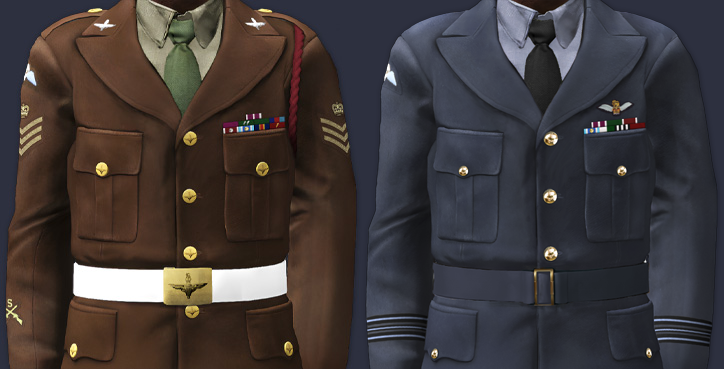

# discourse-project-uniform
This plugin shows a dynamically updating uniform for the 16AA member showing group membership lanyard, rank, qualifications, and awards.

## Debug Mode
Debug Mode can be set to 'true' or 'false' via the first line of code in the assets/javascripts/discourse/lib/pu-utils.js file. Debug Mode true will add browser dev console output and show tooltip areas outlined with red rectangles.

## To-Do
- [ ] Add Discourse Admin panel toggle for debug logs
- [ ] Verify dev console for deprecated stuff
- [ ] RAF Enlisted uniforms + ranks + specific qualifications + awards
- [ ] 7RHA graphics
- [ ] Add Recruit graphics
- [ ] Add and organise implementation of remaining qualifications graphics
- [ ] Community Support Arms ?

## Features & Components Overview

### 1) What the plugin delivers

* **Uniform visual on user profile → Summary tab**
  Automatically renders a British-Army/RAF style uniform image on a member’s Discourse user **Summary** page. The uniform shows background (service & officer/enlisted), rank insignia, unit/group crests, lanyard, qualifications badges, and up to **8** medal ribbons (two rows of four).

* **Smart background selection (BA vs RAF, officer vs enlisted)**
  The plugin infers service & category from the user’s highest rank and picks the corresponding background: BA officer/enlisted, RAF officer/enlisted. Falls back to rank presence if needed.

* **Highest-rank, highest-qualification logic**
  Detects the user’s **highest rank**; for stacked qualifications (leadership, marksmanship, pilot), it shows **only the top** one per track (e.g., Senior Pilot over Junior Pilot; Sniper over Sharpshooter/1st Class). Special rule: certain marksmanship quals are **suppressed for 16CSMR** members.

* **Medal ribbons with priority & cap**
  Ribbons are prioritized by a defined order and **capped at 8** (two rows of four) for a clean layout. Their tooltips use the corresponding full-medal art and description.

* **Rich tooltips (hoverable hot-zones)**
  Hovering rank patches, qualifications, lanyards, group crests, and ribbons shows image-backed tooltips (with small preview image + text). Tooltips fade in/out and don’t interfere with clicks.

* **Per-group visuals & lanyards (including Platoon/FSG/Signals/CSMR)**
  Group membership adds crests and appropriate **lanyard** images; each lanyard has a defined tooltip region on the canvas.

* **Per-service variants for some quals**
  Example: **Paratrooper** badge swaps to a RAF variant when the user’s highest rank is RAF.

* **Clean, shadowed compositing and subtle ribbon transform**
  Images are layered with drop shadows; ribbons are scaled and rotated/skewed slightly for a more realistic pin-on effect.

* **Fast page loads via image caching**
  Foreground and ribbon images are loaded with an in-memory cache to avoid re-downloads.

### 2) How/when it runs (lifecycle & data)

* **Runs only on user Summary pages** and avoids duplicate renders; supports an **admin-only** mode via site setting.

* **Pulls data from core Discourse endpoints**
  Fetches `/u/:username.json` (groups) and `/user-badges/:username.json` (badges) to decide what to render.

* **Discourse Plugin API requirement**
  Uses `withPluginApi("0.8.26")` to hook into page changes safely.

### 3) Tracking “content catalogs” (what can appear on the uniform)

* **Backgrounds** (BA/RAF, officer/enlisted) — defined in one place.
* **Ranks** (BA & RAF, officer & enlisted) — each with canvas hit-areas for rank tooltips.
* **Groups → images & group tooltips** (e.g., 16CSMR variants with RAMC badge tooltip).
* **Lanyards** — grouped by unit roles (Platoons, FSG, Signals, CSMR etc.) with tooltip imagery & text, and a global **lanyard tooltip region** on the canvas.
* **Qualifications** — full catalog with per-rank restrictions and optional **serviceVariants** for RAF swaps; includes leadership, marksmanship, pilot, medical, and courses (FTCC/SCBC/PSBC/PCBC, etc.).
* **Awards** (ribbons ↔ medals) — one authoritative list mapping a ribbon image to a medal image + prose tooltip.

### 4) UX & accessibility details

* **Tooltip styling & behavior**
  Dark, rounded, small-shadow tooltip; hidden by default, fades in/out; supports text or image-plus-text; `role="tooltip"` set when mounted.

* **Canvas hit-testing**
  The code maintains a registry of rectangular “hot zones” and activates the correct tooltip as the cursor moves, with optional debug overlay boxes.

### 5) Rendering & layout rules

* **Single source of truth for layout**
  A “prepare” step assembles background + foregrounds (rank, groups, lanyards, quals) and ribbons; a “render” step composites them and registers matching tooltips.

* **Ribbon layout policy**
  Priority sort, **max 8 ribbons**, arranged in **two rows of four**; tooltips mapped after scale/rotate/skew transforms so hover aligns precisely.

* **Qualification gating**
  Only the top item per track is shown (leadership, marksmanship, pilot). Some quals are **rank-restricted** (e.g., Sniper/Sharpshooter/1st Class disallowed for specific high ranks; the code checks restrictions before drawing).

* **Service-aware badge art**
  If a qual defines `serviceVariants`, the renderer swaps images for RAF users (e.g., Paratrooper RAF).

### 6) Admin/ops & safety

* **Admin-only toggle** via site setting (`project_uniform_admin_only`) — blocks non-admins from seeing the feature when enabled.

* **Defensive checks & duplicate-render guard**
  Skips if not on a Summary page, if the container is missing, or if a placeholder already exists.

### 7) Code structure

* **Initializer (entry point):** page-change hook, data fetch, debug overlay, calls the pipeline. `assets/javascripts/discourse/initializers/project-uniform.js.es6`
* **Data catalog:** backgrounds, ranks, groups, lanyards, quals, awards (+ tooltip metadata & hit-areas). `assets/javascripts/discourse/uniform-data.js`
* **Prepare step:** builds the “what to draw” lists (bg/fg/ribbons/quals), applies throttling and special rules. `lib/pu-prepare.js`
* **Render step:** draws canvas, composes layers, lays out ribbons, registers tooltips. `lib/pu-render.js`
* **Tooltip engine:** registers hit-regions, attaches/fades tooltip DOM, optional debug boxes. `lib/pu-tooltips.js`
* **Styles:** `.canvas-tooltip` CSS. `assets/stylesheets/canvas-tooltip.scss`
* **Assets:** images for uniforms, ranks, groups, lanyards, quals (incl. tooltip variants), ribbons, and medals (folder tree in the code summary).

## Implementation Inventory

### A) Uniform backgrounds (base canvases)

* **British Army – Officer**
* **British Army – Enlisted**
* **RAF – Officer** 
* **RAF – Enlisted**

---

### B) Rank catalog (with tooltip hit-areas)

**British Army – Officers**

* Major, Captain, Lieutenant, Second\_Lieutenant (collar regions)

**British Army – Enlisted**

* Warrant\_Officer\_Class\_2, Colour\_Sergeant, Staff\_Sergeant, Sergeant, Corporal, Lance\_Corporal (sleeve regions)

**Royal Air Force – Officers**

* Squadron\_Leader, Flight\_Lieutenant, Flying\_Officer, Pilot\_Officer (sleeve braid regions)

**Royal Air Force – Enlisted (Aircrew)**

* Flight\_Sergeant\_Aircrew, Sergeant\_Aircrew (sleeve regions)

---

### C) Groups & crests + lanyards

### Group images

* **16CSMR** shows an **RAMC** badge tooltip with two hit-areas on the collar (`groupTooltipMap`).

### Lanyards (image + tooltip)

* **Lightblue & Maroon** (Coy HQ)
* **Red** (1 Platoon)
* **Green** (2 Platoon)
* **Black** (3 Pl; FSG & FSG HQ; 4-1; 13AASR; 16CSMR; 216 Para Signals)
* **Red & Blue** (7RHA)

---

### D) Qualifications (with gating rules)

**Pilot track (only highest shown):**

* **Senior Pilot** (Advanced Flight)
* **Junior Pilot** (Basic Flight)

**Marksmanship track (only highest shown, and suppressed for 16CSMR):**

* **1st Class Marksman** (110/120+) — **restricted** from WO ranks & officers.
* **Sharpshooter** — **restricted** from WO ranks & officers.
* **Sniper** — **restricted** from WO ranks & officers.

**Leadership track (only highest shown):**

* **FTCC** (Fire Team Commanders Course)
* **SCBC** (Section Commanders Battle Course)
* **PSBC** (Platoon Sergeants Battle Course)
* **PCBC** (Platoon Commanders Battle Course)

**Other notable quals:**

* **CMT** (Combat Medical Technician) — only rendered for specific contexts (skipped if not 16CSMR per logic).
* **Paratrooper** — **RAF-specific art** swap via `serviceVariants` when the highest rank is RAF.

---

### E) Ribbons & Awards (with layout, priority, & tooltips)

* Meritorious Service Medal
* Most Valuable Soldier
* Mention in Dispatches with Four Oak Leaves (5× award)
* Mention in Dispatches with Three Oak Leaves (4× award)
* Mention in Dispatches with Two Oak Leaves (3× award)
* Mention in Dispatches with Oak Leaf (2× award)
* Mention in Dispatches (single award)
* Significant Effort Gold
* Significant Effort
* Long Service and Good Conduct Medal with Two Silver Clasps (10 years)
* Long Service and Good Conduct Medal with Silver Clasp (5 years)
* Long Service and Good Conduct Medal (2 years)
* Mission Maker First Class (3rd Operation)
* Mission Maker Second Class (2nd Operation)
* Mission Maker Third Class (1st series of missions)
* Technical Excellence
* RRO Excellence Award
* Recruiter Medal
* Esprit de Corps with Gold Clasp
* Esprit de Corps
* Citation with Four Oak Leaves (5× award)
* Citation with Three Oak Leaves (4× award)
* Citation with Two Oak Leaves (3× award)
* Citation with Oak Leaf (2× award)
* Citation (single award)